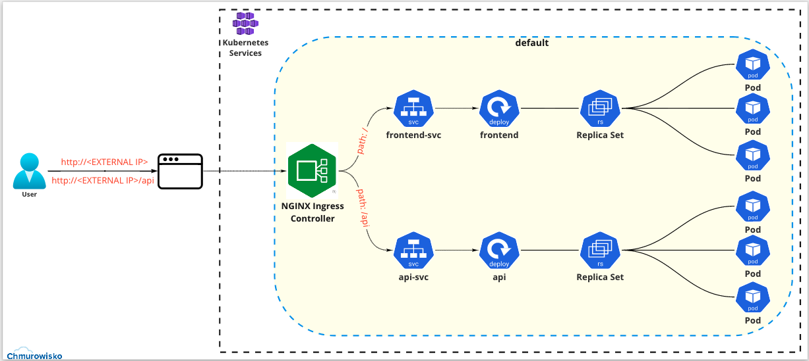

<br><br>
<br><br>
<br><br>

# Praca domowa 2

## Wstęp

Witaj w drugiej pracy domowej, w której rozbudujesz aplikację z pracy domowej 1. Wykorzystasz do tego poznane podczas szkolenia funkcjonalności Kubernetesa. 

Do poprzednich plików wchodzących w skład aplikacji został dodany worker. Worker jest programem uruchamianym raz dziennie (o godzinie 5:00) w celu pobrania informacji o kursach walut z API NBP i zaktualizowania ich w bazie danych.

Obrazy kontenerów, które będą wykorzystywane do deploymentów:
- Frontend: **macborowy/chmurobank-front**
- API: **macborowy/chmurobank-api**
- Worker: **macborowy/chmurobank-exchangerates-downloader**

Istnieje równiez moliwośc pobrania plików z aplikacją i zbudowanie obrazu dla Frontend, API oraz Worker. Następnie nalezy zaaktualizowac te obrazy w swoich repozytoriach na Docker Hub.

W razie jakichkolwiek pytań lub wątpliwości wyślij swój problem wykorzystując [GitHub Discussions](https://github.com/cloudstateu/ic-1-2022/discussions). Możesz również wysłać wiadomość na [maciej.borowy@chmurowisko.pl](mailto:maciej.borowy@chumrowisko.pl) lub [daniel.pisarek@chmurowisko.pl](mailto:daniel.pisarek@chumrowisko.pl).

---

## Poniżej przedstawiono kroki, które powinieneś uwzględnić podczas wykonywania zadania:

## 1. Podzielenie całego rozwiązania na dwa namespace

Stwórz dwa namespace:
- frontend
- backend

Sposób tworzenia namespace i umieszczania w nich komponentów k8s został przedstawiony w ćwiczeniu poświęconym **namespace** - [Link do ćwiczenia](https://github.com/cloudstateu/ic-1-2022/tree/main/Kubernetes/06_namespace). 
W stworzonych namespace umieść odpowiednie kompenenty, tak aby zachować logiczny podział systemu.

## 2. Wykorzystanie Ingress do udostępnienia aplikacji poprzez jeden publiczny adres IP

Wykorzystaj Nginx Ingress Controller w celu udostępnienia aplikacji poprzez jeden adres IP. Skonfiguruj w pliku YAML dotyczącym ingress odpowiednie endpointy i ich serwisy.
Sposób instalacji i konfiguracji Ingress został przedstawiony w ćwiczeniu poświęconym **Ingress** - [Link do ćwiczenia](https://github.com/cloudstateu/ic-1-2022/tree/main/Kubernetes/13_ingress). 

## 3. Stworzenie bazy danych

Utwórz bazę danych w której przechowasz dane pobrane z API NBP za pomocą workera.

Sposób tworzenia i podłączenia bazy danych został przedstawiony w ćwiczeniu poświęconym **podłączaniu bazy danych** - [Link do ćwiczenia](https://github.com/cloudstateu/ic-1-2022/tree/main/Kubernetes/12_connect_to_azure_database).

Po podłączeniu się do serwera bazy danych wykonaj następujące kroki:

 - Stwórz bazę danych `bank`

    ```bash
    CREATE DATABASE bank;
    ```

- Połącz się z utworzoną bazą danych:

    ```
    \c bank
    ```

- Utwórz nową tabelę `exchangerates`

    ```
    CREATE TABLE exchangerates (
      pid SERIAL PRIMARY KEY,
      currency_from varchar(3),
      currency_to varchar(3),
      buy numeric,
      sell numeric,
      effective_date date,
      created_on timestamp DEFAULT CURRENT_TIMESTAMP
    );
    ```

## 4. Udostępnienie worker na klastrze za pomocą CronJob

Worker w tworzonej aplikacji zajmuje się pobraniem danych o kursach walut z API NBP. Worker jest zaimplementowany jako CronJob, co oznacza, że będzie uruchomiony na klastrze zgodnie z harmonogramem opisanym w konfiguracji obiektu CronJob.

Plik YAML do wdrożenia Worker jest już gotowy i znajduje się w pliku: [./files/worker-cronjob.yaml](./files/worker-cronjob.yaml).

Worker powinien zostać udostępniony z wykorzystaniem CronJob ([link do dokumnetacji CronJob](https://kubernetes.io/docs/concepts/workloads/controllers/cron-jobs/)).
Worker powinien korzystać z ConfigMapy, które będzie zawierała informacje pozwalające połączyć się do bazy danych Postgres.

Po wdrożeniu Worker na klaster, sprawdź czy pobiera dane z API NBP i wstawia je do bazy. W razie potrzeby zmień harmonogram uruchomienia CronJob (na np. `* * * * *`, czyli uruchomienie Job co minutę).

## 5. Podłączenie Key Vault w celu przechowywania w nim sekretów do bazy danych

Usługa Key Vault pozowli na bezpieczne przechowywanie sekretów do bazy danych, które będą potrzebne aplikacji do łączenia się z bazą danych (API oraz Worker).

Sposób tworzenia i wykorzystania Key Vault przedstawiono w ćwiczeniu poświęconym **Key Valut** - [Link do ćwiczenia](https://github.com/cloudstateu/ic-1-2022/tree/main/Kubernetes/16_azure_key_vault).

**Uwaga**: Przedstawiony w ćwiczeniu YAML dla `SecretProviderClass` pozwalał na wstrzykiwanie sekretów do Podów jako Volumes. W tym ćwiczeniu użyjesz mechanizmu wstrzykiwania sekretów przez zmienne środowiskowe. Aby zmienić mechanizm użyj specjalnie przygotowanego YAML z `SecretProviderClass`, który znajdziesz w pliku [./files/keyvault.yaml](./files/keyvault.yaml).

**Uwaga**: Instalując Key Vault za pomocą Helm upewnij się, że przeciążysz jedną z domyślnych wartości Helm Chart. Ustaw wartość `secrets-store-csi-driver.syncSecret.enabled` na `true` lub wykorzystaj poniższą komendę do instalacji Azure csi-secrets-store-provider-azure:

```bash
helm install csi csi-secrets-store-provider-azure/csi-secrets-store-provider-azure -n csi --set secrets-store-csi-driver.syncSecret.enabled=true
```

W utworzonym Azure Key Vault utwórz następujące sekrety:

```bash
PGDATABASE: bank
PGHOST: <hostname bazy danych w Azure>
PGPASSWORD: <haslo użytkownika do bazy danych>
PGPORT: "5432"
PGUSER: <użytkownik do bazy danych>
```

Upewnij się, że sekrety mają wartości poprawne dla Twojego środowiska.

## 6. Podłączenie API do bazy danych, tak aby odczytywać informacje o kursach walut

W tym momencie Worker jest usługą odpowiedzialną za pobranie informacji o kursach walut z API NBP. W związku z tym pierwotny kod usługi API został zmieniony, żeby odczytywać dane o kursach walut z bazy danych.

Zaktualizuj Deployment usługi API i sprawdź czy nadal poprawnie wyświetla dane. Do aktualizacji użyj pliku YAML []./files/deployment-api.yaml](./files/deployment-api.yaml).

**Uwaga**: Usługa API w nowej wersji łączy się z bazą danych. Do połączenia z bazą danych wymaga podania wartości uwierzytelniających przez zmienne środowiskowe. Przygotowany [plik YAML (`./files/deployment-api.yaml`)](./files/deployment-api.yaml) został przygotowany, aby odczytać wartości z Secret o nazwie `db-secrets` i wstawiać jego wartości do zmiennych środowiskowych w uruchamianych kontenerach. Secret `db-secrets` jest tworzony przez `SecretProviderClass`, który znajdziesz w pliku [./files/keyvault.yaml](./files/keyvault.yaml).

**Uwaga**: W pliku [./files/worker-cronjob-secrets.yaml](./files/worker-cronjob-secrets.yaml) znajduje się zaktualizowany kod CronJob dla Worker, który również wykorzystuje wstrzykiwanie informacji uwerzytelniających do bazy danych przez Secret. Zaktualizuj CronJob dla Worker i sprawdź czy nadal działa poprawnie i zapisuje informacje do bazy danych.

## 7. Wykorzystanie liveness i readiness probe

W aplikacji API zaimplementowano odpowiednie endpointy, do badania stanu życia aplikacji. Są to:

  - dla Liveness Probe: `/health`
  - dla Readiness Probe: `/ready`

Zadaniem endpoint `/health` jest zwrócenie odpowiedzi 200 OK. Zakładamy, że jeśli aplikacja ulegnie jakiejkolwiek awarii lub zakleszczeniu i nie będzie wstanie zwrócić odpowiedzi wykonując tak prosty kod to z pewnością nie działa ona poprawnie i wymaga restartu.

Zadaniem endpoint `/ready` jest sprawdzenie czy wszystkie zależności aplikacji są gotowe do pracy. W przypadku aplikacji API istnieje jedna zależność - baza danych. Aplikacja API wymaga, żeby baza danych była wstanie odpowiedzieć na zapytania. Jeśli baza nie będzie odpowiadała to aplikacja API nie zrealizuje swojego zadania, czyli nie zwróci informacji o kursach walut dla potencjalnego klienta.

Wykorzystaj mechanizm Probe w celu automatycznego sprawdzenia czy aplikacje działają poprawnie. Obraz aplikacji [macborowy/chmurobank-api:latest](https://hub.docker.com/r/macborowy/chmurobank-api) zawiera już kod aplikacji z zaimplementowanymi endpoint.

Sposób tworzenia i wykorzystania liveness probe został przedstawiony w ćwiczeniu poświęconym **Liveness Probe** - [Link do ćwiczenia](https://github.com/cloudstateu/ic-1-2022/tree/main/Kubernetes/11_probes). Natomiast informację dotyczące tworzenia Readiness Probe  znadują się w dokumentacji Kubernetes - [Link do dokumentacji dotyczącej Readiness Probe](https://kubernetes.io/docs/tasks/configure-pod-container/configure-liveness-readiness-startup-probes/#define-readiness-probes)

W celu przetestowania działania Readiness Probe  możesz wyłączyć bazę danych w Azure. W ten sposób proste zapytania do bazy danych, które jest wykonywane przez endpoint `/ready` nie powiedzie się i Readiness Probe powinien zwrócić porażkę i w ostatczności odłączyć repliki od Load Balancer.

## Zadanie 2 

**Case Study:** Pomóż swoim kolegom z innego zespołu, którzy mają problem z uruchomieniem ich aplikacji. Proszą Cię o pomoc w znalezieniu i naprawieniu błędu w ich wdrożeniu. W tym celu wysyłają Ci plik YAML - [app.yaml](./files/app.yaml), który stworzyli oraz wizualizację poprawnego działania ich aplikacji.



**Zadanie:** Sprawdź działanie aplikacji wdrażanej przez inny zespół i znajdź błąd. Popraw plik YAML tak, aby apliakacja działała w sposób przedstawiony na wizualizacji.
<br><br>

<center><p>&copy; 2022 Chmurowisko Sp. z o.o.<p></center>