<br><br>
<br><br>
<br><br>

# Rollout

## LAB Overview
   In this lab you will work with Deployments. You will create a Deployment, update it, examine its history and will do rollback.

## Task 1: Create a Deployment to rollout a ReplicaSet.

1. Create new file by typing `nano depl.yaml`.
1. Download [manifest file](./files/depl.yaml) and paste its content into editor.
1. Save changes by pressing *CTRL+O* and *CTRL-X*.
1. Type `kubectl apply -f depl.yaml` and press enter.

## Task 2: Examinig the deplyment

1. Run `kubectl get deployments` to check if the Deployment was created.
  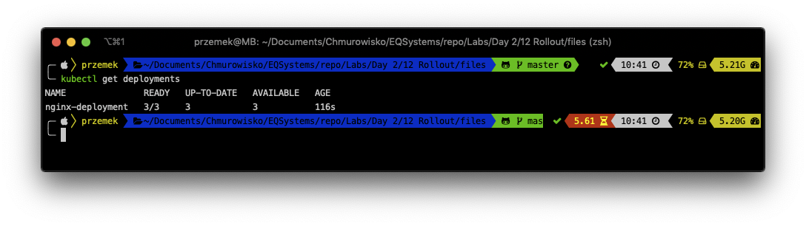

1. You can also check rolout status of the Deployment if it's not ready:
   ```bash
   kubectl rollout status deployment nginx-deployment
   ```
   and run `kubectl get deployments` once again a few seconds later.
   To see the ReplicaSet (rs) created by the Deployment, run `kubectl get rs`.
   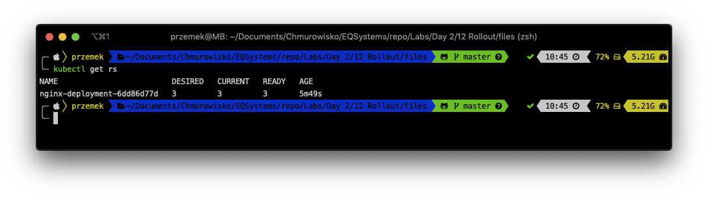
1. You can also see the labels automatically created for each Pod:
   ```bash
   kubectl get pods --show-labels
   ```
   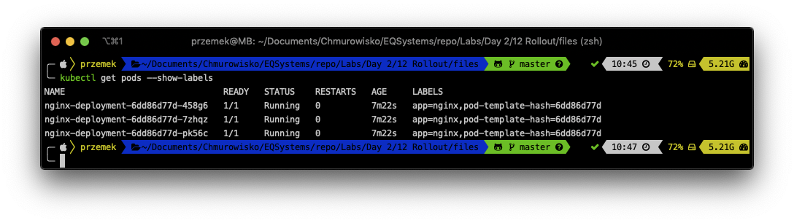
1. Select one of your Pods and create a proxy to it:
   ```bash
   kubectl port-forward <-YOUR-POD-NAME-> 8080:80
   ```
   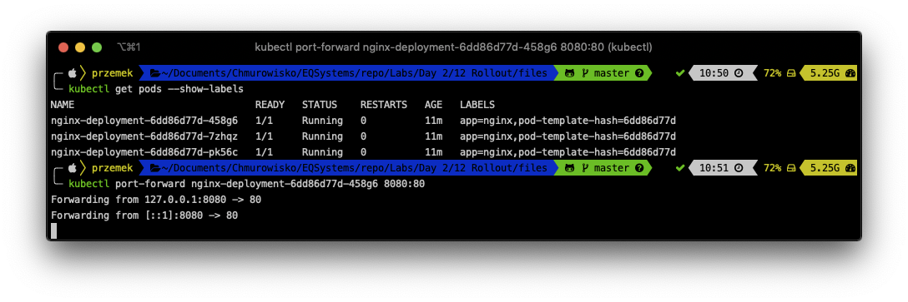
1. Connect to your *nginx* using any browser of your choice.
   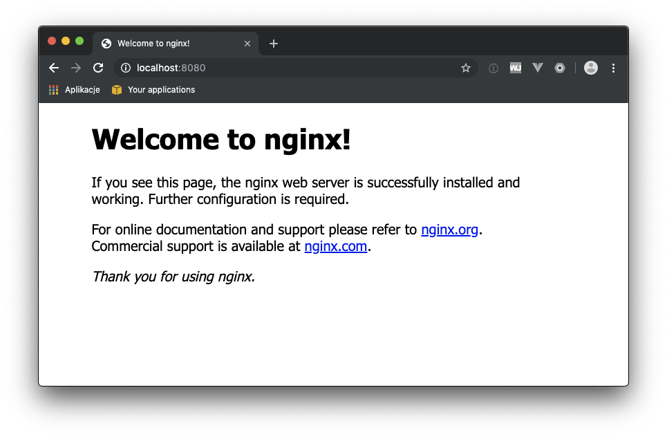
   You can also use *curl* and check the response headers: `curl -I -X GET http://localhost:8080`. You need to use different terminal window.
   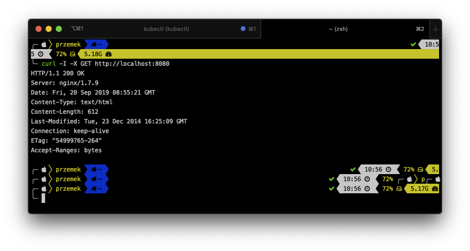

   As you can see, you're using nginx 1.7.9

   Exit the proxy by pressing **CTRL+C**.

## Task 3: Updating the deployment

1. Still in the terminal run the following command:

   ```bash
   kubectl --record deployment.apps/nginx-deployment set image deployment.v1.apps/nginx-deployment nginx=nginx:1.9.1
   ```

1. Check the satus of the Deployment: 

   ```bash
   kubectl rollout status deployment.v1.apps/nginx-deployment
   ```

1. Get the list of ReplicaSets:

   ```bash
   kubectl get rs
   ```

   You can both old and new Replica Set created:
   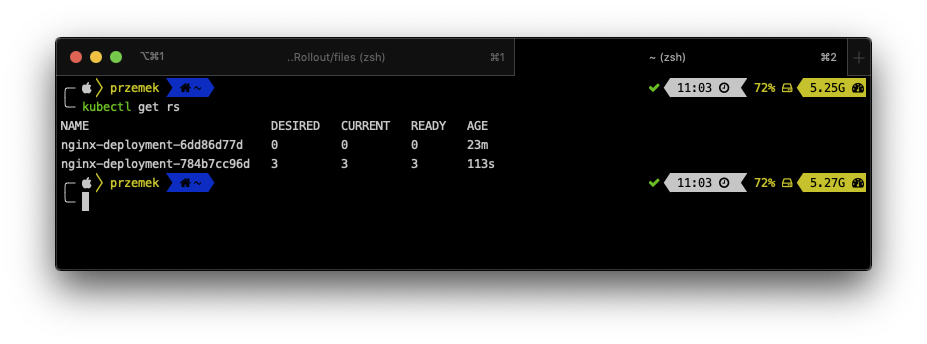

1. Create the proxy to one of your Pod again: `kubectl port-forward <-YOUR-POD-NAME-> 8080:80`.
   Check Pod names again. you have new Pods in your Deployment now.
1. Use the **curl** once again and check the headers of the response:
   ```bash
   curl -I -X GET http://localhost:8080
   ```
   You should have now *nginx* ver. 1.9.1 in the headers.
   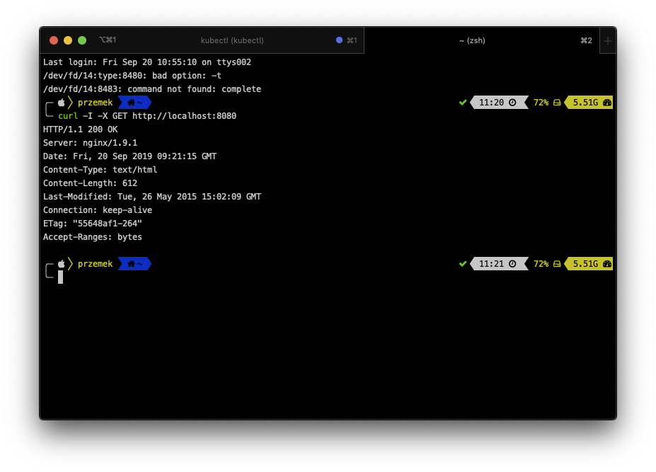
1. Open the manifest file by running:

   ```bash
   nano depl.yaml
   ```

   and edit the file:
   * set replicas to: 5
   * set image to: nginx:1.17.3
   * to deployment's **spec** add:
   ```
   strategy:
     rollingUpdate:
       maxSurge: 1
       maxUnavailable: 1
     type: RollingUpdate
   ```
   * to deployment's **metadata** add

   ```bash
   annotations:
     kubernetes.io/change-cause: "Image change"
   ```
   If you're not quite qure how to do it, you can use [depl2.yaml file](depl2.yaml)

1. Update the Deployment using `kubectl apply -f depl.yaml` or `kubectl apply -f depl2.yaml` command.

   After a while you'll have 5 pods running inside your Deployment.
   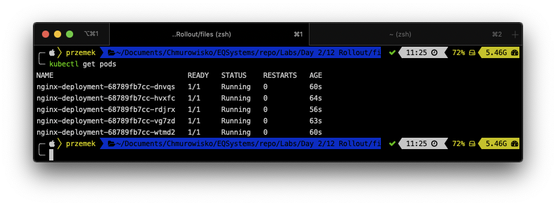

## Task 4: Managing Rollout History

1. Get the history of the Deployment by running:

   ```bash
   kubectl rollout history deployment nginx-deployment
   ```
   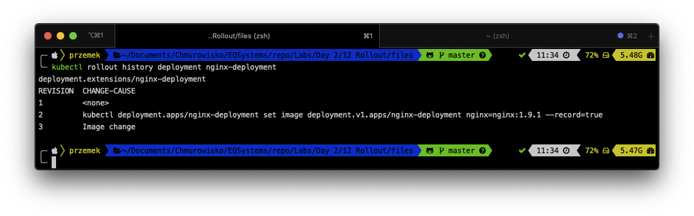

1. If you are interested in more details about a particular revision, you can add the **--revision** flag to view details about that specific revision:

   ```bash
   kubectl rollout history deployment nginx-deployment --revision=2
   ```

   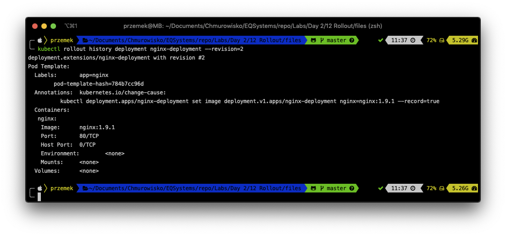

1. Undo the last rollout by running:

   ```bash
   kubectl rollout undo deployments nginx-deployment
   ```

1. Check the history of Deployments

   ```bash
   kubectl rollout history deployment nginx-deployment
   ```
   

   As you notices, there is no longer Deployment 2, and Deployment 4 was added. Now we have revisions 1,3 and 4.

1. Rollback to revision 3 by running

   ```bash
   kubectl rollout undo deployments nginx-deployment --to-revision=3
   ```
   and check the history: `kubectl rollout history deployment nginx-deployment`
   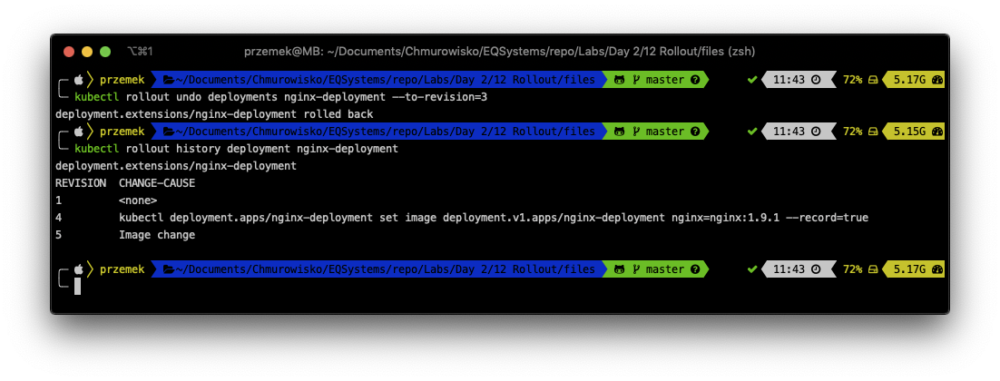

1. Please delete the Deployment:

   ```bash
   kubectl delete deployment nginx-deployment
   ```

## END LAB
<center><p>&copy; 2021 Chmurowisko Sp. z o.o.<p></center>
