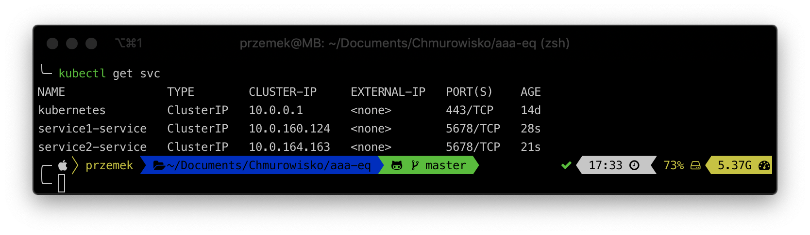

<br><br>
<br><br>
<br><br>

# Ingress

## Lab Overview

In this lab you will work create Ingress and expose a few services over single IP address.

During this lab you will manually install NGINX Ingress Controller.

## Task 1: Creating Ingress Controller anc LoadBalancer

1. View a [manifest file](./files/mandatory.yaml) containing required Ingress objects.
1. Create required Ingress objects: 

    ```bash
    kubectl apply -f mandatory.yaml
    ```

1. View [manifest file](./files/cloud-generic.yaml) containing Service object for Ingress. This service will expose single External IP address to request services inside cluster.
1. Create a Service:

    ```bash
    kubectl apply -f cloud-generic.yaml
    ```

1. Check if objects are created:

    ```bash
    kubectl get all -n ingress-nginx
    ```

Also, you should have a load balancer deployed now. Please check if it's ready.


## Task 2. Create Services exposing sample applications

Applications use [`hashicorp/http-echo`](https://hub.docker.com/r/hashicorp/http-echo/) image. This image contains an in-memory web server that renders an HTML page containing the contents of the arguments provided to it. This image is especially useful for demos or a more extensive "hello world" Docker application.

In this example `service1-service` should return "service1" plain text response. `sercice2-servce` should respond with "service2".

1. Verify [manifest file](./files/service1.yaml) of Service
1. Create 2 services using command below: 

    ```bash
    kubectl apply -f service1.yaml -f service2.yaml
    ```

You should have two services now


## Task 3: Create Ingress object

Ingress object will configure how incoming request should be routed.

1. Create Ingress object: 

    ```bash
    kubectl apply -f ingress.yaml
    ```

## Task 4: Try the solution

1. Find your load balancer public IP.

    

1. Using curl (or your browser) request following URLs:

    ```bash
    curl <YOUR-LOAD-BALANCER-IP>/srv1
    curl <YOUR-LOAD-BALANCER-IP>/srv2
    ```

You should get different responses from both services you deployed in task 2.

## Task 5: Create 3rd service

1. Based on [`service1.yaml`](./files/service1.yaml) create a new Pod and expose it through a Service inside cluster. Change response text to "service3".
1. Configure Ingress to expose 3rd Service on `/srv3` path
1. Paste the URL to the 3rd Service on a chat.

## END LAB

<br><br>

<center><p>&copy; 2019 Chmurowisko Sp. z o.o.<p></center>
