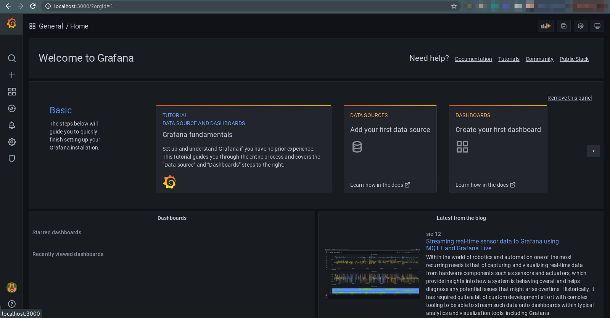
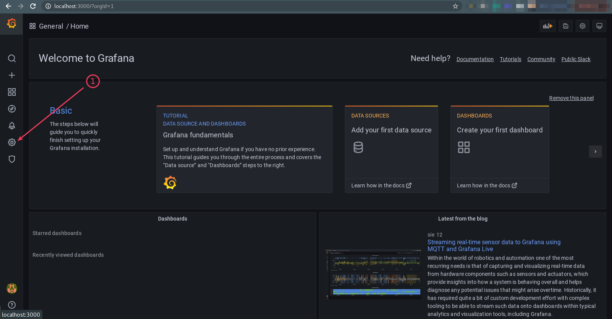
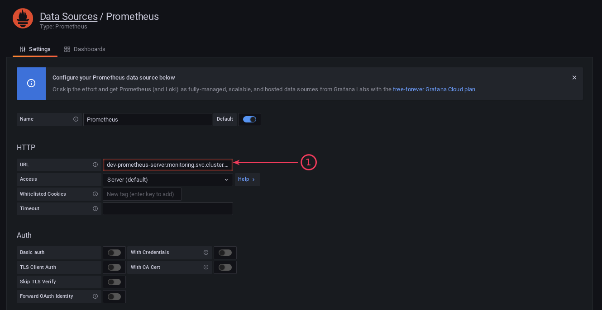
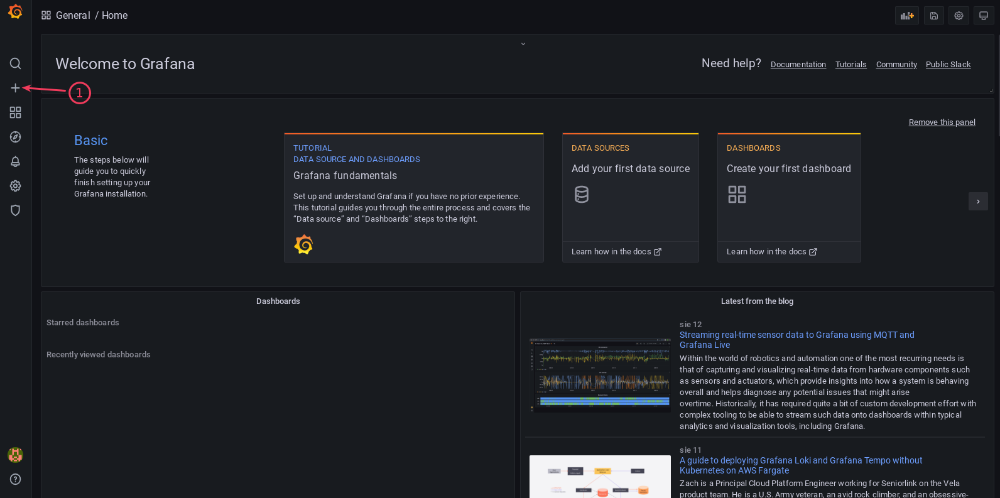
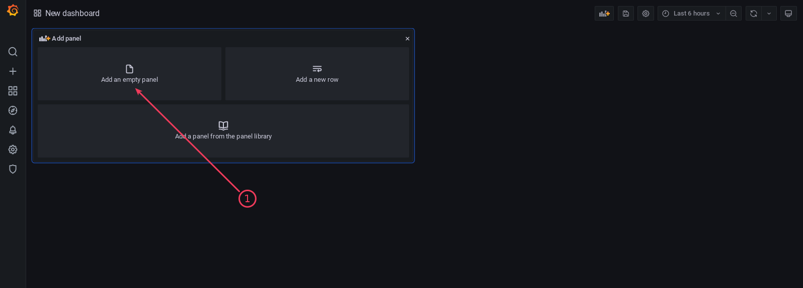
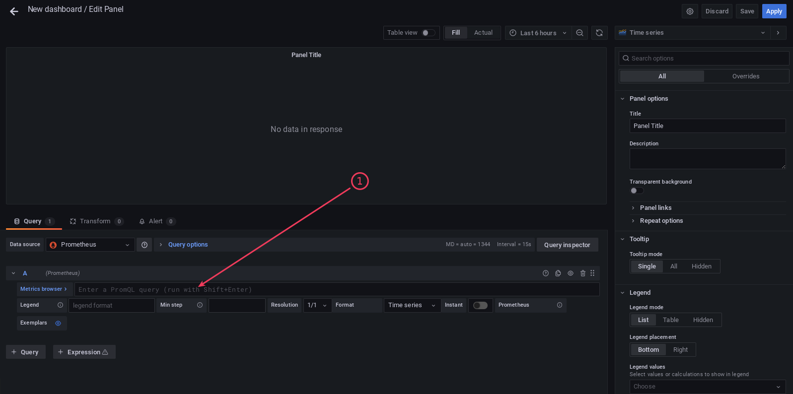
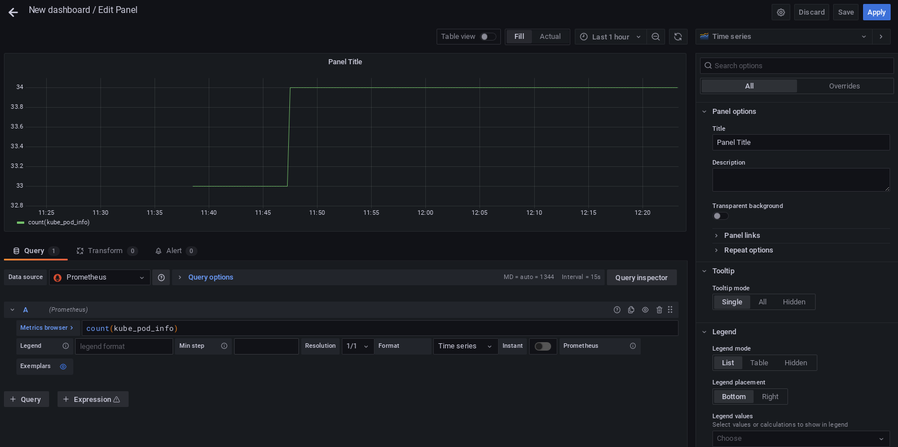

# Prometheus and Grafana

## LAB Overview

In this lab you will deploy Prometheus and grafana

## Prerequisite: Install Helm

1. Follow the instructions: https://helm.sh/docs/intro/quickstart/

## Task 1: Create new namespace

1. Create new namespace for further deployments:

    ```bash
    kubectl create ns monitoring
    ```

## Task 2: Install Prometheus

1. Open browser and check contents of the official Helm Chart for Prometheus: https://artifacthub.io/packages/helm/prometheus-community/prometheus

1. Add Helm repository

    ```bash
    helm repo add prometheus-community https://prometheus-community.github.io/helm-charts
    ```

    ```bash
    helm repo add kube-state-metrics https://kubernetes.github.io/kube-state-metrics
    ```

    ```bash
    helm repo update
    ```

1. Install prometheus:

    ```bash
    helm install my-prometheus prometheus-community/prometheus -n monitoring
    ```

## Task 3: Install Grafana

1. Visit the Grafana Helm Chart repository: https://artifacthub.io/packages/helm/grafana/grafana

1. Add Helm repository for Grafana

    ```bash
    helm repo add grafana https://grafana.github.io/helm-charts
    ```

    ```bash
    helm repo update
    ```

1. Install Grafana

    ```bash
    helm install my-grafana grafana/grafana -n monitoring
    ```

1. Get the `admin` account password

    ```bash
    kubectl get secret --namespace monitoring my-release-grafana -o jsonpath="{.data.admin-password}" | base64 --decode ; echo
    ```

1. Forward the traffic to Grafana URL

    ```bash
    export GRAFANA_POD_NAME=$(kubectl get pods --namespace monitoring -l "app.kubernetes.io/name=grafana,app.kubernetes.io/instance=my-release" -o jsonpath="{.items[0].metadata.name}")
    ```

    ```bash
    kubectl --namespace monitoring port-forward $GRAFANA_POD_NAME 3000
    ```

1. Visit the Grafana service on http://localhost:3000. Login using `admin` account and password from the previous step

    

## Task 4: Connect Grafana to Prometheus server

1. Go to terminal and find Prometheus Server URL

    ```bash
    echo $(kubectl get svc --namespace monitoring -l "app=prometheus,component=server" -o jsonpath="{.items[0].metadata.name}").monitoring.svc.cluster.local
    ```

1. In Grafana UI go to _Configuration_ > _Data sources_

    

1. Click on _Add data source_, choose _Prometheus_

1. Configure connection to Prometheus

    ```bash
    URL: (paste Prometheus Server URL)
    ```

    

1. Go to bottom of the page and click on _Save & test_.

## Task 5: Configure dashboard

1. Create a new dashboard

    

1. Choose _Add an empty panel_

    

1. In _Metrics browser_ textbox paste the following query

    ```bash
    count(kube_pod_info)
    ```

    

1. Check number of currently running Pods on your cluster

    

---

## END LAB

<br><br>

<center><p>&copy; 2021 Chmurowisko Sp. z o.o.<p></center>
